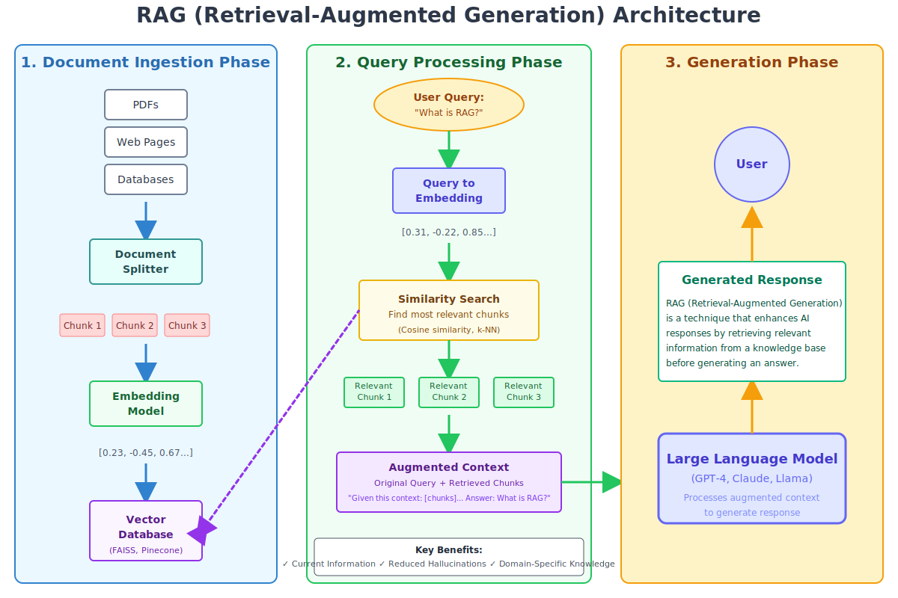

# Agentic RAG

Agentic RAG (Retrieval-Augmented Generation) is a framework designed to enhance AI models with retrieval capabilities, enabling them to access and utilize external knowledge sources effectively.

## Features

- **Retrieval-Augmented Generation**: Combines generative AI with retrieval mechanisms for improved accuracy.
- **Customizable**: Easily adaptable to various domains and datasets.
- **Scalable**: Designed to handle large-scale knowledge bases.

## Requirements

- Python 3.12+
- Dependencies listed in `requirements.txt`

## Contributing

Contributions are welcome! Please fork the repository and submit a pull request.

## License

This project is licensed under the MIT License. See the `LICENSE` file for details.
